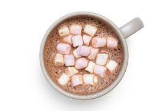

# Hot Chocolate

## Ingredients:

* 100 ml milk
* 10 g sugar
* 25 g cocoa
* 50 g chocolate

## How to prepare:

1. Place the milk of your choice in a **saucepan** over **medium-low** heat. 
1. Whisk in cocoa powder and sugar, and **heat until warm.**
1. Once the milk **is warm**, add chocolate.
1. Serve immediately, topped with your favorite garnishes and **enjoy!**
