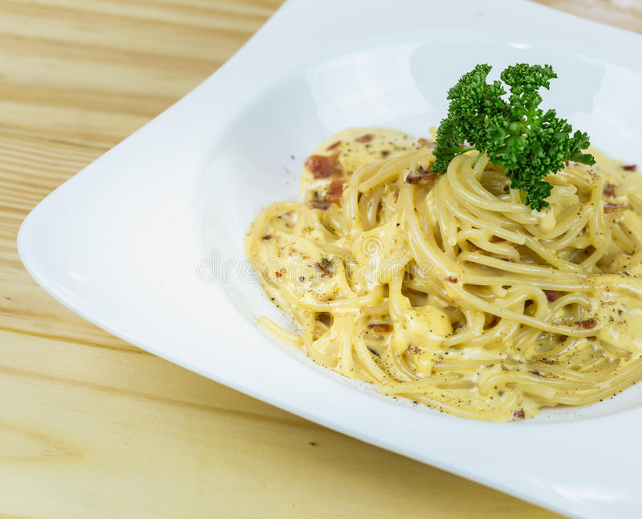

#  PASTA CARBONARA

## INGREDIENTS:
- 1 tablespoon extra virgin olive oil or unsalted butter
- 1/2 pound pancetta or thick cut bacon, diced
- 1 to 2 garlic cloves, minced, about 1 teaspoon (optional)
- 3 to 4 whole eggs
- 1 cup grated Parmesan or pecorino cheese
- 1 pound spaghetti (or bucatini or fettuccine)
- salt and freshly ground black pepper to taste

## HOW TO PREPARE:

1. Heat the pasta water:
    - Put a large pot of salted water on to boil (1 tablespoon salt for every 2 quarts of water.)
2. Sauté the pancetta or bacon and garlic:
    - While the water is coming to a boil, heat the olive oil or butter in a large sauté pan over medium heat. Add the bacon or pancetta and cook slowly until crispy.
    - Add the garlic (if using) and cook another minute, then turn off the heat and put the pancetta and garlic into a large bowl.
3. Beat the eggs and half of the cheese:
    - In a small bowl, beat the eggs and mix in about half of the cheese.
4. Cook the pasta:
    - Once the water has reached a rolling boil, add the dry pasta, and cook, uncovered, at a rolling boil.
5. Toss the pasta with pancetta or bacon:
    - When the pasta is al dente (still a little firm, not mushy), use tongs to move it to the bowl with the bacon and garlic. Let it be dripping wet. Reserve some of the pasta water.
    - Move the pasta from the pot to the bowl quickly, as you want the pasta to be hot. It's the heat of the pasta that will heat the eggs sufficiently to create a creamy sauce.
    - Toss everything to combine, allowing the pasta to cool just enough so that it doesn't make the eggs curdle when you mix them in. (That's the tricky part.)
6. Add the beaten egg mixture:
    - Add the beaten eggs with cheese and toss quickly to combine once more. Add salt to taste. Add some pasta water back to the pasta to keep it from drying out.
    - Serve at once with the rest of the parmesan and freshly ground black pepper. If you want, sprinkle with a little fresh chopped parsley.